# 💰 Expense Tracker API (FastAPI + SQLite)

## 📌 Project Overview
A backend REST API built using **FastAPI** for managing personal expenses with secure authentication.

Users can register, log in, manage categories, and perform full CRUD operations on expenses. Each user can only access their own data using JWT-based authentication.

---

## 🚀 Tech Stack
- Python
- FastAPI
- SQLite
- SQLAlchemy (ORM)
- Passlib (bcrypt)
- JWT Authentication (python-jose)
- Uvicorn

---

## 📸 API TEST PREVIEW (Swagger UI)

### 🔐 Authentication

#### Register User
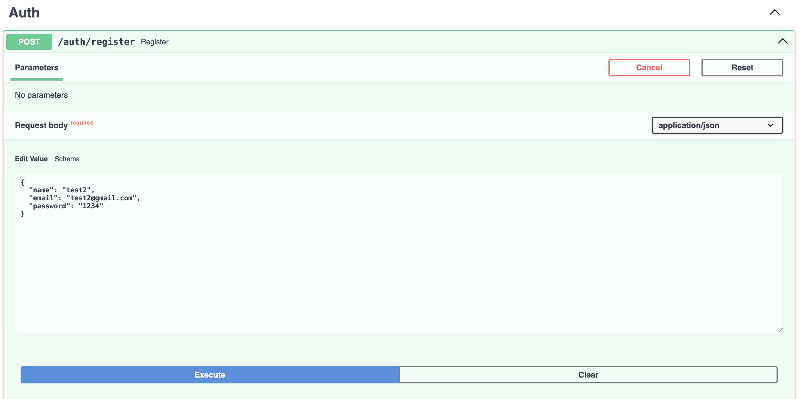

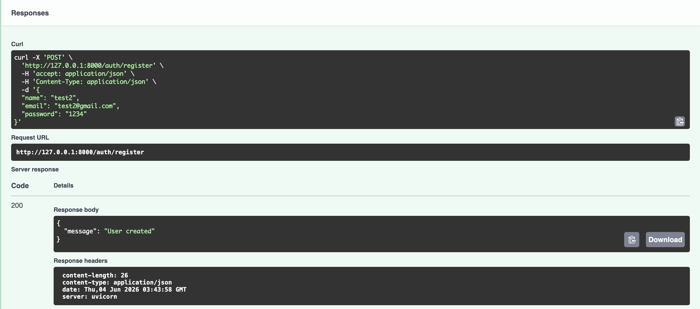

#### Login User
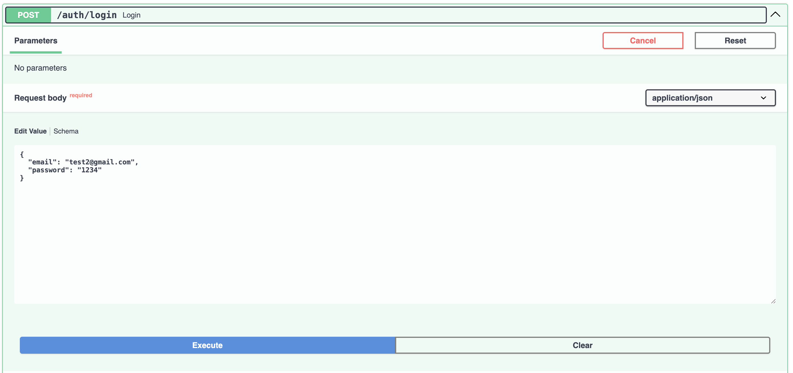

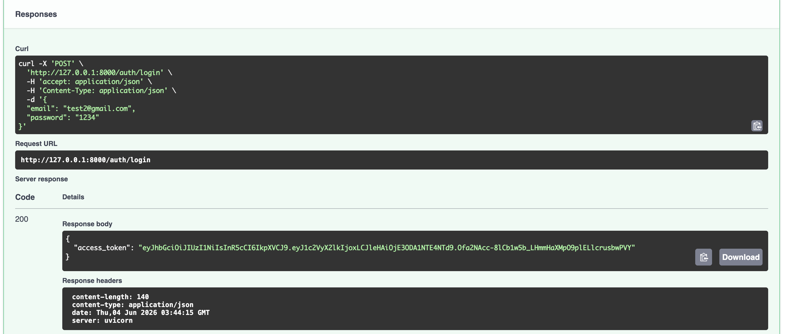

---

#### Authorization
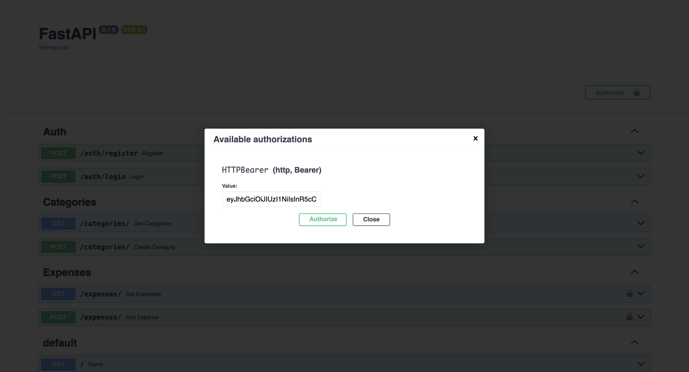

---

### 📂 Categories

#### Get Categories
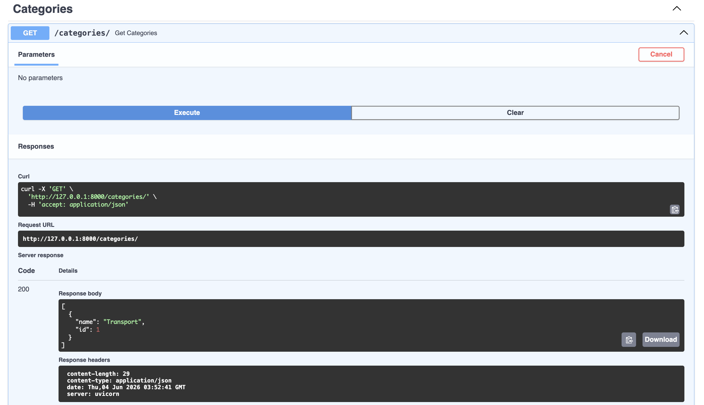

#### Create Category
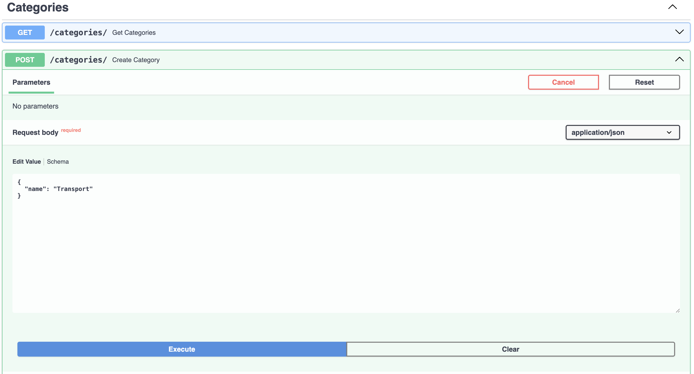


---

### 💰 Expenses

#### Get Expenses
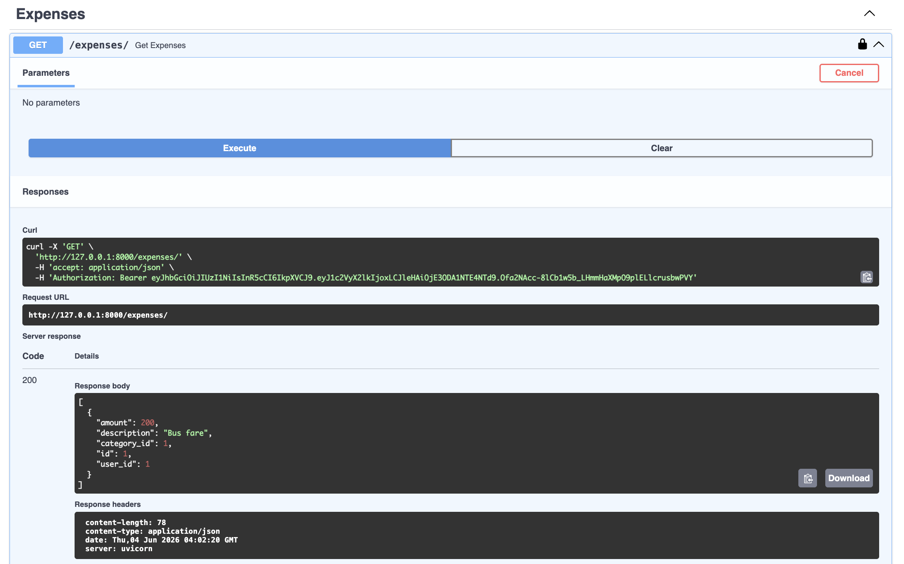

#### Create Expense
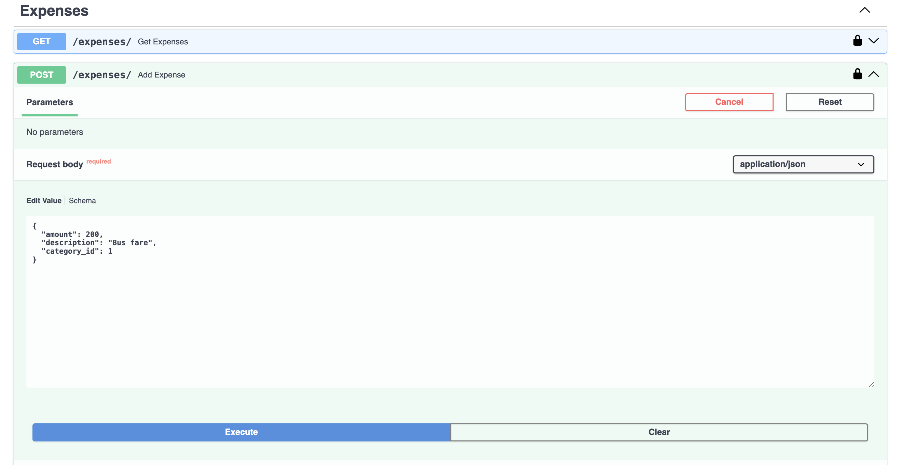

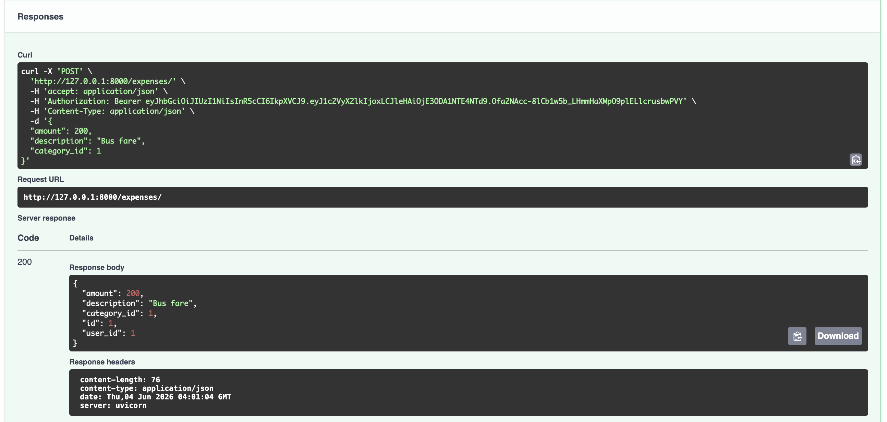

#### Update Expense
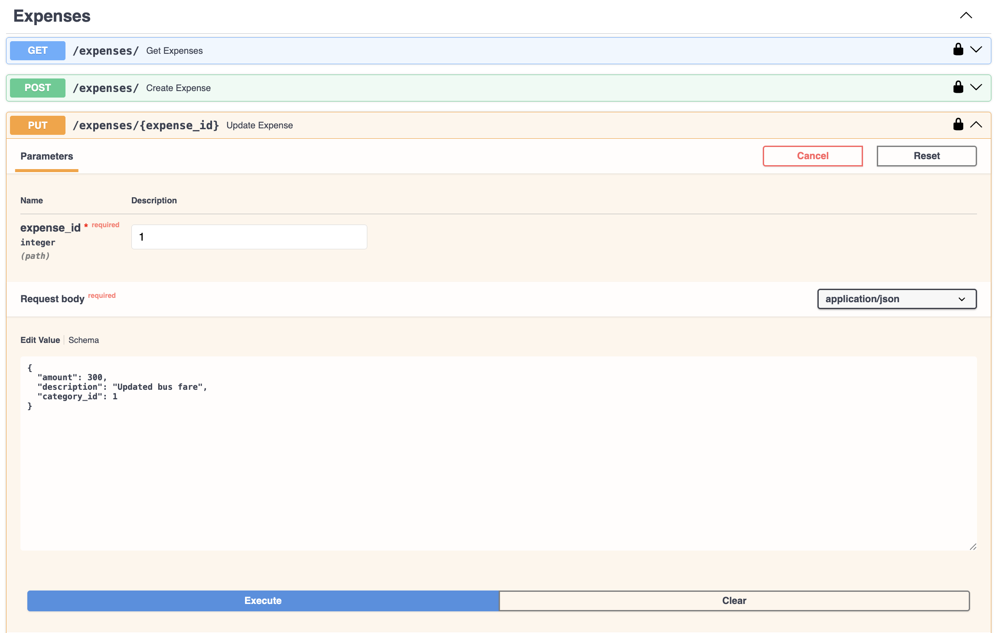

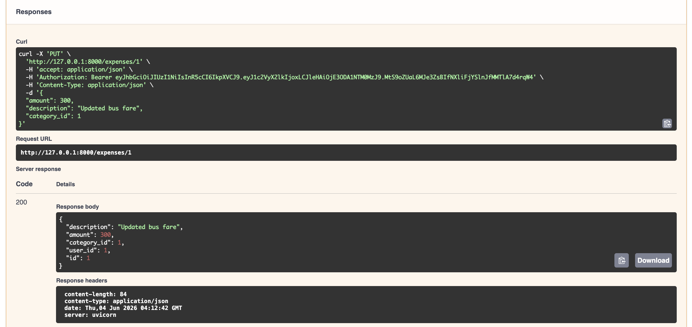

#### Delete Expense
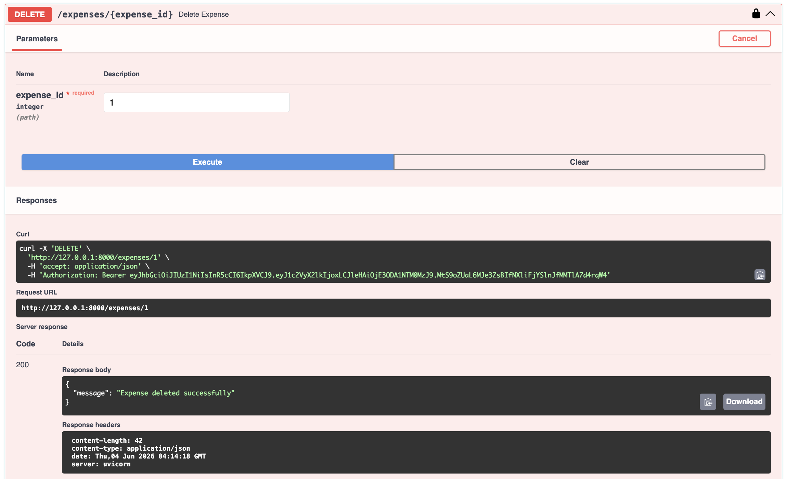


---

## 📁 Project Structure
```
expense-tracker-api/
│
├── app/
│   ├── main.py
│   ├── database.py
│   ├── models.py
│   ├── schemas.py
│   ├── utils.py
│   ├── auth.py
│   ├── jwt_handler.py
│   │
│   └── routes/
│       ├── auth.py
│       ├── categories.py
│       └── expenses.py
│
├── images
├── requirements.txt
├── .gitignore
└── README.md
```

---

## 🔐 Authentication Flow
- Register user
- Login user
- Receive JWT token
- Use token to access protected routes (categories & expenses)

### Authorization Header
Authorization: Bearer <your_token>

---

## 📌 API ENDPOINTS

### 🔐 Auth
- POST `/auth/register` → Register user  
- POST `/auth/login` → Login user  

### 📂 Categories
- GET `/categories/` → Get all categories  
- POST `/categories/` → Create category  

### 💰 Expenses
- GET `/expenses/` → Get user expenses  
- POST `/expenses/` → Create expense  
- PUT `/expenses/{expense_id}` → Update expense  
- DELETE `/expenses/{expense_id}` → Delete expense  

---

## 🖥️ RUN PROJECT

### MAC (macOS / Linux)
```
python3 -m venv venv  
source venv/bin/activate  
pip install -r requirements.txt  
uvicorn app.main:app --reload  
```

### WINDOWS (CMD)
```
python -m venv venv
venv\Scripts\activate
pip install -r requirements.txt
uvicorn app.main:app --reload
```

### WINDOWS (POWERSHELL)
```
python -m venv venv
venv\Scripts\Activate.ps1
pip install -r requirements.txt
uvicorn app.main:app --reload
```

---

## 📍 SWAGGER UI
http://127.0.0.1:8000/docs 

---

## 🧠 Key Learnings
- Building REST APIs using FastAPI  
- JWT authentication and authorization  
- SQLAlchemy ORM for database handling  
- SQLite database integration  
- CRUD operations design  
- Secure backend architecture with user isolation  

---

## 👤 Author
**Sadikshya Karki**
